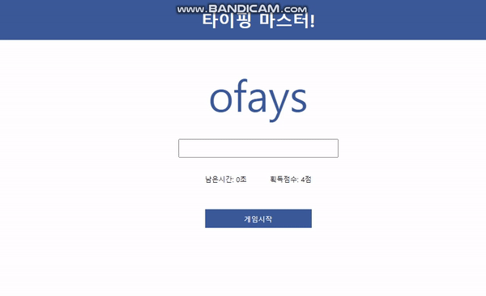

# 타이핑 게임 클론코딩

사용 Stect

- HTML
- CSS
- Vanilla JavaScript

출처: Youtube 데브리
https://www.youtube.com/watch?v=_CsGSE5gwTA&t=1479s

## 게임 설명

1. 게임 시작을 누르면 타이핑 Input-box로 이동함
2. 시작하면 카운트 다운이 시작됨.
3. 랜덤으로 나오는 문자를 입력하고,정답이면 다음 문자가 출력됨.
4. 정답을 입력하면 획득점수가 1점씩 증가함.(소문자로 입력해도 정답으로 인정됨.)
5. 남은시간이 0초가 되면 게임이 종료됨.
6. 게임 시작을 누르면 남은시간과 획득 점수가 초기화됨.

## API 출처

- random API http://random-word-api.herokuapp.com/home

## 개선사항 하고 싶은 기능

1. 타이핑 정답을 입력하고 다음단어로 넘어가면 카운트다운(남은시간)의 숫자가 초기화
2. 단어의 길이가 긴것은 나오지 않게 변경

## 어려웠던 것.

- 아무리 클론 코딩이였어도 모르는 용어,메서드,함수가 많아서 어려웠음
- 여태까지 배웠던 함수는 정말 간단한 로직이였구나를 깨닫게됨.
- 삼항연산자,변수선언,연산자 등 이론적으로 배웠지만 어느부분에 적용해야할지 모르겠음.
- 코드 로직을 이해하지 못함.

## 클론코딩 하면서 느낀 솔직한 마음

- 솔직히 이렇게 하는게 맞는지 잘 모르겠음.
- 클론코딩 후 모르는 용어,함수 등 다시 이론을 공부해야 하는지,클론코딩을 하는 중간중간에 멈춰놓고 해야할지 모르겠음 전자가 맞는거 같기도함(아직 확신이 안듬)

## 앞으로의 공부 방향

- 클론 코딩으로 내가 무엇을 모르는지 파악했으니까, 모르는 부분만 집중적으로 검색하고 메모하고 반복해서 읽으며 이해하기.
- 클론코딩 -> 모르는 부분 메모 -> 검색-> 메모하면서 정리-> 반복해서 읽으면서 이해하기

## 클론코딩 코드

```// 랜덤으로 뜨는 text와 비교해서 text와 같을 경우 점수를 1점 올려주는 코드를 작성한다.
//점수는 변경되어야 하기 때문에 변수의 선언은 let으로 한다
const GAME_TIME = 9;
let word = [];
let score = 0;
let time = GAME_TIME;
let isPlaying = false;
let TimeInterval;
let checkInterval;


const wordInput = document.querySelector('.word-input');
const wordDisplay = document.querySelector('.word-display');
const scoreDisplay =document.querySelector('.score');
const timeDisplay =document.querySelector('.time');
const button = document.querySelector('.button')


//화면이 랜더링 됐을때 선언하기?

init();

function init(){
  buttounChange('게임로딩중..');
  getWords();
  wordInput.addEventListener('input', checkMatch)
}

//'게임시작'버튼을 눌렀을때 카운트다운이 실행되도록 만들기
//Html button에 onclick="run()" 추가

//게임실행
function run() {
  if(isPlaying){
    return;
  }
  isPlaying = true;
  time = GAME_TIME;
  wordInput.focus();
  scoreDisplay.innerText = 0;
  TimeInterval = setInterval(countDown,1000);
  checkInterval = setInterval(checkStatus, 50)
  buttounChange('게임중')
}

function checkStatus() {
  if(!isPlaying && time === 0){
    buttounChange('게임시작')
    clearInterval(checkInterval)
  }
}

//단어 불러오기
function getWords() {
  // Make a request for a user with a given ID
  axios.get('https://random-word-api.herokuapp.com/word?number=100')
    .then(function (reponse) {
        reponse.data.forEach((word) => {
          if (word.length <10 ) {
              words.push(word);
          }
        })
      console.log(words);
      buttounChange('게임시작');
    })


    .catch(function (error) {
      // handle error
      console.log(error);
    })

  words = ['Hello','Banana','Apple','Cherry'];
  buttounChange('게임시작')
}

//console 창의 값을 받아오기 위해서 무엇을 해야할까?
//이벤트를 걸어준다
//wordInput.addEventListener('이벤트','기능')


//단어 일치 체크
function checkMatch (){
  if(wordInput.value.toLowerCase() === wordDisplay.innerText.toLowerCase()){
    wordInput.value =""; //정답일때 input value 초기화
    if  (!isPlaying) { //게임중이 아닐때, 점수가 올라가지 않도록 return을 걸어준다
      return;
    }
    score++; //if에서 true라면 score를 +1씩 증가시킨다
    scoreDisplay.innerText = score; //점수가 +1씩 올라가는 변수가 담겨있음
    const randomIndex = Math.floor(Math.random() * words.length);   //랜덤함수
    wordDisplay.innerText = words[randomIndex]
  }

}

//함수를 1초마다 실행시켜주는 interval(인터벌(=시간적인 간격)) 만들기
// setInterval(countDown,1000);


//button을 눌렀을때 남은시간이 카운트다운(시간제한)이 되도록 만들기
function countDown(){
    time > 0 ? time -- : isPlaying =false; //삼항연산자
    if(!isPlaying) {
      clearInterval(TimeInterval)
    }
    timeDisplay.innerText = time;
}


// button-loading class가 사라지도록 만들기
function buttounChange(text){
  button.innerText =text;
  text === '게임시작' ? button.classList.remove('loading') : button.classList.add('loading')
}

//처음 본 메서드
//.innerText , .toLowerCase():소문자로 비교해주는 메서드?

//복습하기
//삼항연산자, 전역변수


```
